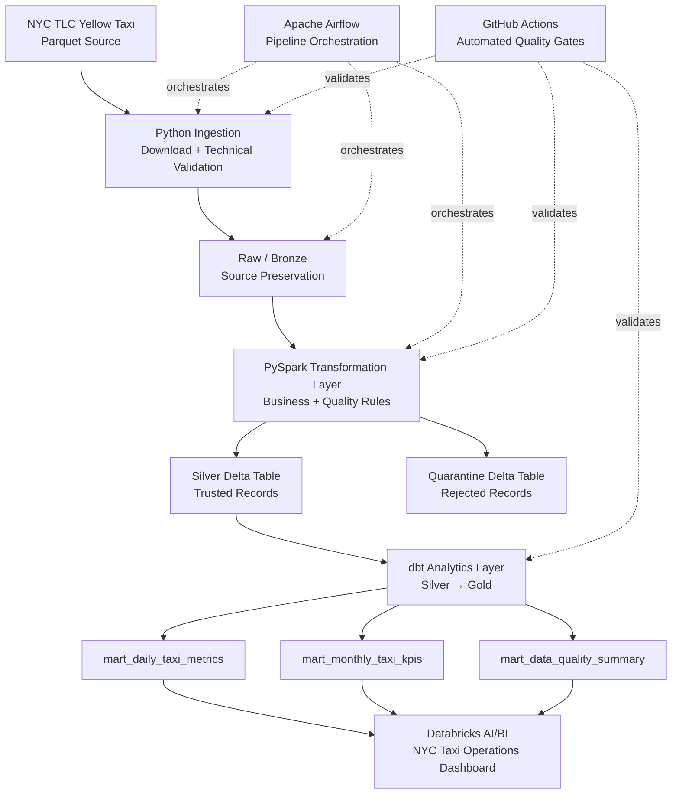

# Production Data Platform — NYC Taxi

[](https://github.com/fabiodonizetibaptista/production-data-platform/actions/workflows/ci.yml)

Production-oriented Data Engineering project built around the **NYC TLC Yellow Taxi January 2026** dataset.

The project demonstrates an end-to-end data platform using Python, Apache Airflow, PySpark, Delta Lake, Databricks, Unity Catalog, dbt, Docker, automated testing, CI/CD, data quality controls, observability, and Databricks AI/BI.

The objective is not only to transform data, but to demonstrate engineering practices such as explicit data contracts, reproducible execution, validation gates, quarantine, lineage, testability, analytics engineering, and clear separation between processing, semantic, and visualization layers.

---

## Architecture



### Current orchestration boundary

Airflow currently orchestrates the ingestion and local validation pipeline:

```text
ingest
  ↓
validate_raw
  ↓
raw_to_silver
  ↓
validate_silver
```

The Databricks and dbt Gold execution path is intentionally kept separate in the current project scope.

This avoids claiming an orchestration integration that has not yet been implemented.

---

## Dataset

Source: **NYC Taxi & Limousine Commission — Yellow Taxi Trip Records, January 2026**

Input file:

```text
yellow_tripdata_2026-01.parquet
```

Initial dataset:

```text
3,724,889 rows
20 columns
```

Pipeline reconciliation:

| Layer | Rows |
|---|---:|
| Raw / Bronze | 3,724,889 |
| Silver | 3,724,881 |
| Quarantine | 8 |
| Silver + Quarantine | 3,724,889 |

The reconciliation is exact:

```text
Raw = Silver + Quarantine
```

The quarantine contains structurally invalid records such as:

- pickup outside the expected January 2026 processing window;
- dropoff timestamp earlier than pickup timestamp.

Semantic anomalies that may still represent real source data are preserved and surfaced as quality indicators instead of being silently deleted.

Examples include:

- missing passenger count;
- zero trip distance;
- negative fare amount;
- negative total amount.

---

## Data Engineering Layers

### Raw / Bronze

The source dataset is preserved with minimal transformation.

Responsibilities include:

- source acquisition;
- download integrity checks;
- schema contract validation;
- critical null validation;
- source lineage;
- preservation of source-level anomalies.

The ingestion flow writes to a temporary `.part` file and validates the result before promoting it to the final source file.

---

### Silver

PySpark applies deterministic transformations and separates trusted records from quarantined records.

The canonical transformation logic is version-controlled in:

```text
src/spark/nyc_taxi_transforms.py
```

Main responsibilities:

- lowercase / normalized column names;
- lineage fields;
- trip duration calculation;
- temporal validation;
- semantic quality flags;
- Silver / Quarantine separation.

Core Spark transformation logic lives outside the notebook so it can be reused and tested independently.

---

### Gold

The analytical layer is implemented with **dbt**.

#### `mart_daily_taxi_metrics`

Grain:

```text
one row per pickup_date
```

Provides daily operational KPIs and daily quality indicators.

#### `mart_monthly_taxi_kpis`

Grain:

```text
one row per pickup_month
```

Provides executive monthly KPIs, including:

- total trips;
- total amount;
- total distance;
- average amount per trip.

The average amount metric is defined in Gold from additive measures, preserving a single semantic definition outside the BI layer.

#### `mart_data_quality_summary`

Grain:

```text
one row per pickup_month + quality_issue
```

Provides monthly quality indicators used by the dashboard.

Quality counts use defensive aggregation:

```sql
coalesce(sum(...), 0)
```

so the Gold contract returns `0` instead of `NULL` when an issue count is absent.

---

## Thin BI Principle

Business metric definitions belong in the analytical layer.

The Databricks AI/BI dashboard is intentionally treated as a **thin consumption layer**:

```text
Silver
   ↓
dbt Gold
   ↓
Business semantics
   ↓
Databricks AI/BI
   ↓
Visualization
```

This reduces metric drift between consumers and keeps business semantics testable and version-controlled.

The `Average Amount per Trip` counter consumes the monthly Gold metric with `MAX(average_amount_per_trip)` because the dashboard is explicitly scoped to January 2026 and the monthly mart contains one row per month.

---

## Databricks and Lakehouse

The cloud execution path uses **Databricks Free Edition** with serverless compute and Unity Catalog.

Current Unity Catalog organization:

```text
workspace
├── nyc_taxi_bronze
├── nyc_taxi_silver
└── nyc_taxi_gold
```

Main managed Delta objects:

```text
workspace.nyc_taxi_bronze.yellow_taxi_trips

workspace.nyc_taxi_silver.yellow_taxi_trips
workspace.nyc_taxi_silver.yellow_taxi_trips_quarantine

workspace.nyc_taxi_gold.mart_daily_taxi_metrics
workspace.nyc_taxi_gold.mart_monthly_taxi_kpis
workspace.nyc_taxi_gold.mart_data_quality_summary
```

The production notebook imports transformation logic from the repository rather than duplicating transformation rules inside the notebook.

Development workflow:

```text
Git / VS Code
     ↓
version-controlled Python
     ↓
Databricks CLI sync
     ↓
Databricks Workspace
     ↓
serverless execution
```

Git remains the source of truth.

---

## Databricks AI/BI Dashboard

Dashboard: **NYC Taxi Operations — January 2026**

### Executive KPIs

- Total Trips
- Total Amount
- Total Distance
- Average Amount per Trip

### Daily trends

- Daily Trips
- Daily Average Amount per Trip

### Data quality

- Missing passenger count
- Zero distance
- Negative total amount
- Negative fare

Published dashboard:

https://dbc-d7715295-e2d4.cloud.databricks.com/dashboardsv3/01f1c283e83a1c73a7bf01a8350ae767/published?o=7474646281512184

Authentication to the Databricks workspace may be required.

The version-controlled dashboard definition is stored at:

```text
databricks/dashboard/NYC_Taxi_Operations_January_2026.lvdash.json
```

---

## dbt Execution Targets

The project supports two dbt execution environments.

### Local development

DuckDB is used for fast local analytics development and CI validation.

### Databricks

The production-oriented analytical path uses:

```text
dbt-databricks
      ↓
Unity Catalog Silver
      ↓
Gold tables
```

Target-aware staging logic allows the same dbt project to consume either local Parquet data or the Databricks Silver table without duplicating analytical models.

---

## Testing Strategy

The project uses multiple testing layers.

### Python unit and integration tests

```text
16 tests
```

They cover ingestion, validation, transformation, orchestration-supporting logic, and failure scenarios.

### PySpark tests

```text
10 tests
```

The Spark transformation module reached:

```text
100% src/spark coverage
```

### dbt

Latest validated builds:

```text
Local / DuckDB
PASS=19
WARN=0
ERROR=0
```

```text
Databricks
PASS=17
WARN=0
ERROR=0
```

dbt validation includes:

- `not_null`;
- uniqueness;
- composite-grain validation;
- analytical-model contract checks.

---

## CI/CD

GitHub Actions runs automated validation on pull requests.

Current gates include:

```text
Unit Tests
Integration Tests
Coverage Gate
Spark Tests
dbt Build
```

Changes are developed through feature branches and merged through pull requests.

The project also uses a separate AI Data Engineering reviewer that analyzes pull-request diffs and posts findings back to the PR for human evaluation.

AI findings are treated as review input rather than blindly applied: each finding is checked against architecture, runtime evidence, tests, and project scope before a change is accepted.

---

## Security Practices

The project deliberately avoids committing credentials.

Databricks authentication is provided through environment variables:

```text
DATABRICKS_HOST
DATABRICKS_HTTP_PATH
DATABRICKS_TOKEN
```

The dbt execution wrapper validates required variables without printing their values.

Local Databricks synchronization metadata and developer-specific dbt metadata are excluded from version control.

Relevant ignored paths include:

```text
.databricks/
.user.yml
```

Additional security practices used during development include:

- staged secret scanning;
- no hardcoded PATs or API keys;
- no `eval` / `exec` based command execution;
- quoted shell arguments;
- environment-based credential injection;
- review of dynamic SQL trust boundaries.

### Development networking note

The dbt Databricks wrapper currently uses Docker host networking as a development workaround for nested Docker networking inside GitHub Codespaces.

This is a known environment-specific trade-off and should not be treated as the preferred network model for a production deployment.

---

## Observability and Data Quality

The pipeline distinguishes between three categories.

### Blocking failures

Conditions that violate the technical contract and should stop processing.

### Semantic warnings

Suspicious values that may still be valid source records and should remain observable instead of being silently removed.

### Quarantine

Records that cannot safely participate in the trusted analytical dataset.

The local pipeline also produces execution logs and audit information to support troubleshooting and reconciliation.

---

## Repository Structure

```text
.
├── .github/
│   └── workflows/
├── dags/
│   └── nyc_taxi_pipeline.py
├── databricks/
│   ├── dashboard/
│   ├── notebooks/
│   │   ├── learning/
│   │   └── production/
│   └── sql/
├── dbt/
│   ├── models/
│   │   ├── staging/
│   │   ├── intermediate/
│   │   └── marts/
│   ├── profiles/
│   └── tests/
├── docker/
├── scripts/
│   └── dbt_databricks.sh
├── src/
│   └── spark/
├── tests/
├── docker-compose.yml
├── requirements-dev.txt
├── requirements-spark-dev.txt
└── README.md
```

---

## Key Engineering Decisions

Several decisions in the project are intentional.

**Raw data is preserved.**
Source anomalies are not silently corrected before they can be observed.

**Technical failures and semantic anomalies are treated differently.**
A suspicious business value is not automatically equivalent to a corrupted record.

**Transformation logic is separated from notebooks.**
Core Spark behavior can therefore be tested and reused.

**Gold owns business semantics.**
The BI layer remains thin.

**Local and cloud dbt execution share the same analytical models.**
Environment-specific concerns are isolated in sources and profiles.

**Git is the source of truth for Databricks code.**
Workspace notebooks are synchronized from version-controlled artifacts.

**Full-refresh Delta writes are intentional in the current scope.**
The current dataset represents a fixed monthly processing scope. Incremental ingestion and Delta MERGE semantics are future platform evolutions rather than partially implemented behavior.

---

## Current Limitations and Future Evolution

This project intentionally stops before several capabilities that would be required in a larger production environment.

Potential next evolutions include:

- incremental ingestion;
- Delta MERGE-based upserts;
- multi-period processing;
- Databricks Jobs orchestration;
- Databricks Asset Bundles;
- workload/service identity instead of developer PAT authentication;
- environment-isolated catalogs;
- infrastructure provisioning with Terraform;
- centralized production monitoring and alerting.

These are documented as explicit next steps rather than hidden behind incomplete abstractions.

---

## Technology Stack

| Area | Technology |
|---|---|
| Language | Python |
| Data Processing | PySpark |
| Lakehouse | Delta Lake |
| Cloud Data Platform | Databricks |
| Governance | Unity Catalog |
| Analytics Engineering | dbt |
| Local Analytics | DuckDB |
| Orchestration | Apache Airflow |
| Containers | Docker / Docker Compose |
| Testing | pytest / Spark tests / dbt tests |
| CI/CD | GitHub Actions |
| BI | Databricks AI/BI |
| Source Control | Git / GitHub |

---

## Project Outcome

The project demonstrates a complete engineering path from source acquisition to analytical consumption:

```text
External Parquet
      ↓
validated ingestion
      ↓
Raw / Bronze
      ↓
PySpark transformation
      ↓
Silver + Quarantine
      ↓
dbt Gold
      ↓
tested analytical marts
      ↓
Databricks AI/BI
```

The final platform preserves source traceability, reconciles all input records, exposes data-quality issues, separates business semantics from visualization logic, and validates changes through automated tests and pull-request gates.

This repository is part of a hands-on Data Engineering portfolio focused on production-oriented engineering practices rather than isolated technology demonstrations.
